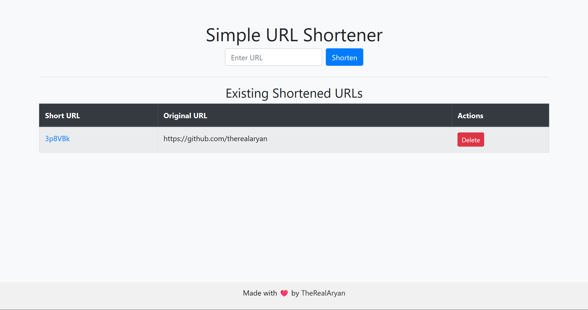

# Simple URL Shortener

A simple URL shortener built with Flask. This application allows users to shorten long URLs, manage the shortened URLs, and provides a simple web interface to interact with.
I created this help shorten personal links i always use on my machine.



## Features

- **Shorten long URLs**
- **Normalize URLs**: Automatically handles trailing slashes and case insensitivity to avoid duplicates.
- **Manage URLs**: List all shortened URLs with options to delete them.
- **Simple and clean interface**: Uses Bootstrap.
- **Easy storage**: URLs are stored in a JSON file to retain them across server restarts.

### Prerequisites

- **Python** (3.6 or later recommended)
  - **Flask**: A web framework for Python
- **Git** (optional, if cloning the repository using Git)

### Installing
**Download or Clone the repository**:
Download the ZIP from GitHub or using Git:
   ```bash
   git clone https://github.com/TheRealAryan/Simple-URL-Shortener.git
   cd url-shortener
  ```

## Getting Started
1. Run **app.py** to start the server
2. On your web browser, go to http://127.0.0.1:5000 (or whatever URL the terminal displays)
   - By default, the URL shortener is hosted on your local machine, meaning it will only be accessible from the computer running the application

### Making It Accessible beyond your machine:
If you want to access the URL shortener from other devices on your network or from the internet:
- Port Forwarding
- Set up a DNS name
- Cloud Hosting

## Future Plans
Some potential features and improvements planned for the future if I have time:
- **Custom Short URLs**: Allow users to specify their own custom short IDs.
- **Analytics/Click Tracking**: Track how many times each shortened URL has been accessed.
- **Expiration Date for URLs**: Add the ability to set expiration dates after which the shortened URL will no longer work.
- **User Authentication**: Implement a simple authentication system so users can manage their own set of short URLs.
- **Database Integration**: Replace the JSON file storage with a more scalable solution like SQLite.
